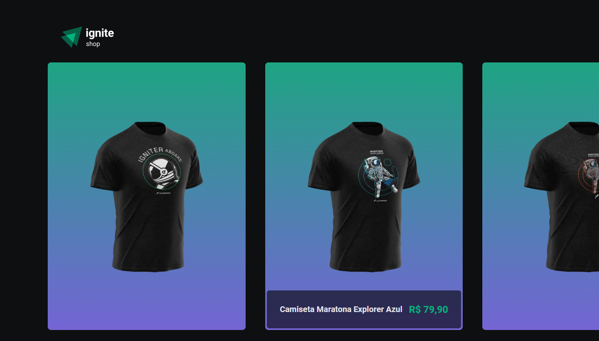
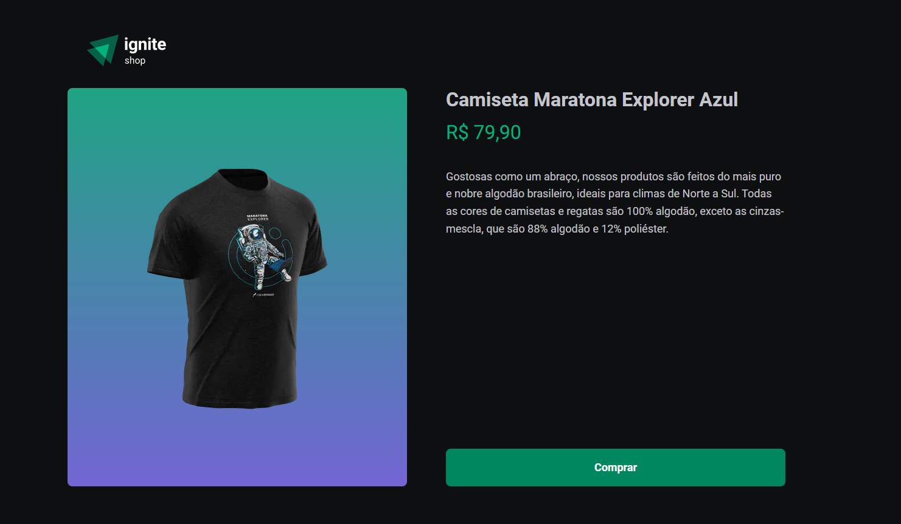
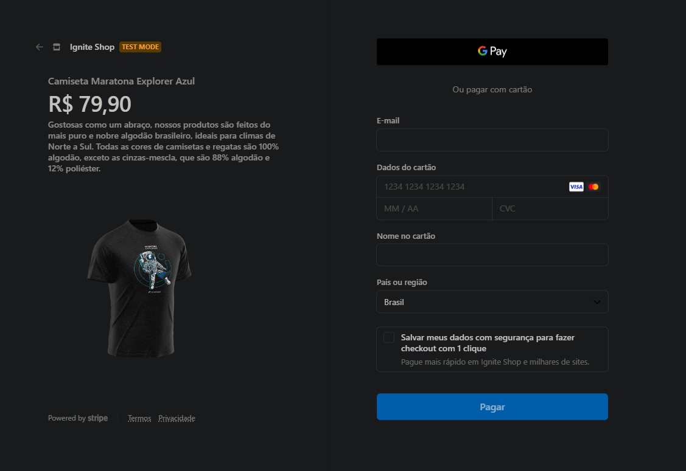
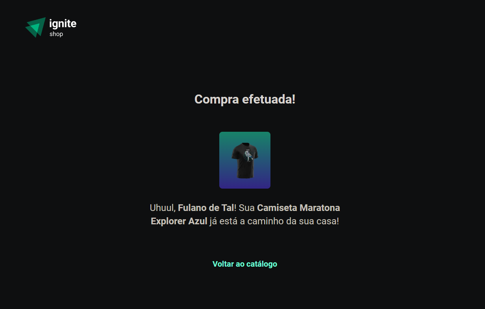

# DT Money

#  <br/> <br/>
#  <br/> <br/>
#  <br/> <br/>
#  <br/> <br/>

## Funcionalidades da aplicação
- Inspecionar produto
- Comprar produto
- Realizar o checkout via stripe

## Tecnologias utilizadas
- React
- Next JS
- TypeScript
- Stitches
- Keen Slider
- Stripe

### Instalação
1. Clone o repositório:

```bash
git clone https://github.com/jlefilho/ignite-shop.git
```

2. Acesse a pasta do projeto:

```bash
cd ignite-shop
```

3. Instale as dependências necessárias:

```bash
npm install
```

4. Crie uma conta no Stripe e coloque suas chaves de API no 
arquivo `.env.local`

```bash
# .env.local

STRIPE_PUBLIC_API_KEY=apipublicasemaspas
STRIPE_SECRET_API_KEY=apiprivadasemaspas
NEXT_URL=http://localhost:3000
```

5. Execute o projeto:

```bash
npm run dev
```

6. Para testar a compra, use o número de cartão `4242 4242 4242 4242`
